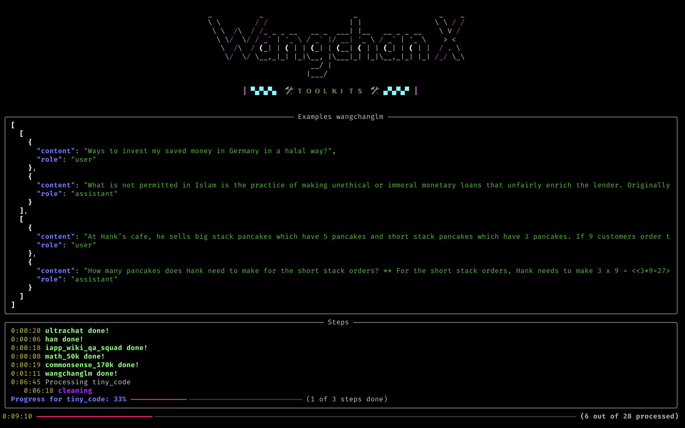

# FLAN-like Dataset Creator



This script creates a FLAN (Finetuned Language Models Are Zero-Shot Learners) like dataset by combining various datasets from different sources. It loads datasets from HuggingFace, custom datasets, and performs data processing and reformatting to prepare the data for training.

## Table of Contents

<!-- vim-markdown-toc GFM -->

* [📦 Installation](#-installation)
* [🚀 Usage](#-usage)
* [💡 Arguments](#-arguments)
* [⚡️ Description](#-description)
* [🔥 Examples](#-examples)
* [🔎 Dataset Details](#-dataset-details)

<!-- vim-markdown-toc -->

## 📦 Installation

```
pip install -r requirements.txt
```

## 🚀 Usage

```

python script_name.py [-h] [--metadata METADATA] [--template TEMPLATE] [--cache_dir CACHE_DIR]
[--num_proc NUM_PROC] --output_dir OUTPUT_DIR [--metafile METAFILE]
[-c DATASET_NAME SAMPLE_COUNT] [-s {jsonl,csv,arrow}]
[-d {huggingface,pandas,none}]

```

## 💡 Arguments

| Argument                   | Short | Description                                                                                                                                                                                | Default                                                                   |
| -------------------------- | ----- | ------------------------------------------------------------------------------------------------------------------------------------------------------------------------------------------ | ------------------------------------------------------------------------- |
| `--metadata`               | `-m`  | Path to the JSON file containing the metadata for creating the FLAN dataset.                                                                                                               | "default" (automatically downloads from `flan_creator/dataset_info.json`) |
| `--template`               | `-t`  | Path to the JSON file containing the template for creating the FLAN dataset.                                                                                                               | "default" (automatically downloads from `data_formatter/template.json`)   |
| `--cache_dir`              | -     | Directory to cache the downloaded datasets.                                                                                                                                                | "./cache"                                                                 |
| `--num_proc`               | -     | Number of processes to use for parallel processing. Set to a value greater than 1 to enable multiprocessing.                                                                               | 1                                                                         |
| `--output_dir`             | `-o`  | Directory to save the resulting FLAN dataset.                                                                                                                                              | (required)                                                                |
| `--metafile`               | `-mf` | Path to save the dataset metadata.                                                                                                                                                         | "./metadata/metafile.txt"                                                 |
| `--customize_dataset_size` | `-c`  | Customize the number of samples for a specific dataset. Can be used multiple times. Provide the dataset name and the desired sample count (positive integer, 'all', 'half', or 'quarter'). | -                                                                         |
| `--save_format`            | `-s`  | Save the dataset in the specified format. Can be 'jsonl', 'csv', or 'arrow'.                                                                                                               | "arrow"                                                                   |
| `--drop_mode`              | `-d`  | Drop duplicates mode. Can be 'huggingface', 'pandas', or 'none'.                                                                                                                           | "none"                                                                    |

## ⚡️ Description

This script creates a FLAN-like dataset by combining and processing data from various sources:

1. Loads datasets from HuggingFace and custom sources
2. Processes and reformats the data for training
3. Allows customization of dataset sizes, saving formats, and duplicate handling
4. Supports parallel processing for improved performance

> [!WARNING]
> Ensure you have the necessary permissions to access and download datasets from HuggingFace. Run following command to login to HuggingFace:

```bash
huggingface-cli login
```

## 🔥 Examples

1. Basic usage:

```

python main.py --output_dir ./flan_dataset

```

2. Customize dataset size and save format:

```

python main.py --output_dir ./flan_dataset -c dataset1 1000 -c dataset2 500 -s jsonl

```

3. Use custom metadata and template files:

```

python main.py --metadata custom_metadata.json --template custom_template.json --output_dir ./flan_dataset

```

4. Enable parallel processing:

```

python main.py --output_dir ./flan_dataset --num_proc 4

```

## 🔎 Dataset Details

An overview of a curated collection of datasets designed for natural language processing tasks, with a focus on Thai language applications. These datasets span a range of tasks including Summarization, Translation, Text Generation, Text Classification, and Question Answering. Each dataset is accompanied by its source, size, intended task, and licensing information, making it easy for users to identify and utilize the datasets that best fit their needs.

| Dataset Name                            | Source                                                                                                            | Quantity (row)                                        | Task                | Domain       | License                                                                                                                                                                                          |
| --------------------------------------- | ----------------------------------------------------------------------------------------------------------------- | ----------------------------------------------------- | ------------------- | ------------ | ------------------------------------------------------------------------------------------------------------------------------------------------------------------------------------------------ |
| ultrachat_200k                          | [HuggingFaceH4/ultrachat_200k](https://huggingface.co/datasets/HuggingFaceH4/ultrachat_200k)                      | 200k                                                  | Text Generation     | Mixed        | [MIT License](https://opensource.org/license/mit)                                                                                                                                                |
| han-instruct-dataset-v2.0               | [pythainlp/han-instruct-dataset-v2.0](https://huggingface.co/datasets/pythainlp/han-instruct-dataset-v2.0)        | 3.2k                                                  | Text Generation     | Mixed        | [CC BY-SA 4.0](https://creativecommons.org/licenses/by-sa/4.0/deed.en)                                                                                                                           |
| iapp_wiki_qa_squad                      | [iapp/iapp_wiki_qa_squad](https://huggingface.co/datasets/iapp/iapp_wiki_qa_squad)                                | 5.7k                                                  | Question Answering  | Web Content  | [MIT License](https://opensource.org/license/mit)                                                                                                                                                |
| math_50k                                | [AGI-Edgerunners/LLM-Adapters](https://github.com/AGI-Edgerunners/LLM-Adapters/raw/main/ft-training_set)          | 49.6k                                                 | Text Generation     | Mixed        | [Apache License 2.0](https://choosealicense.com/licenses/apache-2.0/)                                                                                                                            |
| commonsense_170k                        | [AGI-Edgerunners/LLM-Adapters](https://github.com/AGI-Edgerunners/LLM-Adapters/raw/main/ft-training_set)          | 166k                                                  | Text Generation     | Mixed        | [Apache License 2.0](https://choosealicense.com/licenses/apache-2.0/)                                                                                                                            |
| wangchanglm                             | [pythainlp/final_training_set_v1](https://huggingface.co/datasets/pythainlp/final_training_set_v1)                | 309k                                                  | Text Generation     | Mixed        | [Apache License 2.0](https://choosealicense.com/licenses/apache-2.0/), [MIT License](https://opensource.org/license/mit), [CC BY-SA 4.0](https://creativecommons.org/licenses/by-sa/4.0/deed.en) |
| tiny-code                               | [nampdn-ai/tiny-codes](https://huggingface.co/datasets/nampdn-ai/tiny-codes)                                      | 364k                                                  | Text Generation     | Mixed        | [MIT License](https://opensource.org/license/mit)                                                                                                                                                |
| flanV2                                  | [SirNeural/flan_v2](https://huggingface.co/datasets/SirNeural/flan_v2)                                            | 96k                                                   | Text Generation     | Mixed        | [Apache License 2.0](https://choosealicense.com/licenses/apache-2.0/)                                                                                                                            |
| cotV2                                   | [SirNeural/flan_v2](https://huggingface.co/datasets/SirNeural/flan_v2)                                            | 364k                                                  | Text Generation     | Mixed        | [Apache License 2.0](https://choosealicense.com/licenses/apache-2.0/)                                                                                                                            |
| alt                                     | [mutiyama/alt](https://huggingface.co/datasets/mutiyama/alt)                                                      | 18k                                                   | Translation         | Mixed        | [CC BY 4.0](https://creativecommons.org/licenses/by/4.0/deed.en)                                                                                                                                 |
| ThaiSum                                 | [thaisum](https://huggingface.co/datasets/thaisum)                                                                | 359k                                                  | Summarization       | News         | [MIT License](https://opensource.org/license/mit)                                                                                                                                                |
| scb-mt-en-th-2020                       | [scb_mt_enth_2020](https://huggingface.co/datasets/scb_mt_enth_2020)                                              | 801k                                                  | Translation         | Mixed        | [CC BY-SA 4.0](https://creativecommons.org/licenses/by-sa/4.0/deed.en)                                                                                                                           |
| xP3x                                    | [CohereForAI/xP3x](https://huggingface.co/datasets/CohereForAI/xP3x)                                              | 299k                                                  | Other               | Mixed        | [Apache License 2.0](https://choosealicense.com/licenses/apache-2.0/)                                                                                                                            |
| Open-Platypus                           | [garage-bAInd/Open-Platypus](https://huggingface.co/datasets/garage-bAInd/Open-Platypus)                          | 18.3k                                                 | Other               | Mixed        | Multiple Licenses                                                                                                                                                                                |
| Wisesight Sentiment Corpus              | [wisesight_sentiment](https://huggingface.co/datasets/wisesight_sentiment)                                        | 21.15k                                                | Text Classification | Social Media | [CC0-1.0](https://creativecommons.org/publicdomain/zero/1.0/deed.en)                                                                                                                             |
| Thai Food Recipe dataset v1.0           | [pythainlp/thai_food_v1.0](https://huggingface.co/datasets/pythainlp/thai_food_v1.0)                              | 159                                                   | Text Generation     | Book         | [CC0-1.0](https://creativecommons.org/publicdomain/zero/1.0/deed.en)                                                                                                                             |
| thai-wiki-dataset-v3                    | [pythainlp/thai-wiki-dataset-v3](https://huggingface.co/datasets/pythainlp/thai-wiki-dataset-v3)                  | 194k                                                  | Text Generation     | Web Content  | [CC BY-SA 3.0](https://creativecommons.org/licenses/by-sa/3.0/deed.en)                                                                                                                           |
| klongklon                               | [pythainlp/klongklon](https://huggingface.co/datasets/pythainlp/klongklon)                                        | 54k                                                   | Text Generation     | Book         | [MIT License](https://opensource.org/license/mit)                                                                                                                                                |
| Thai USembassy                          | [pythainlp/thai_usembassy](https://huggingface.co/datasets/pythainlp/thai_usembassy)                              | 615                                                   | Translation         | News         | [CC0-1.0](https://creativecommons.org/publicdomain/zero/1.0/deed.en)                                                                                                                             |
| Wongnai Reviews                         | [wongnai_reviews](https://huggingface.co/datasets/wongnai_reviews)                                                | 40k                                                   | Text Classification | Social Media | [lgpl-3.0](https://www.gnu.org/licenses/lgpl-3.0.html)                                                                                                                                           |
| Thai sentiment analysis dataset         | [thai-sentiment-analysis-dataset](https://github.com/PyThaiNLP/thai-sentiment-analysis-dataset)                   | 341 (123 tcas61, 128 review_shopping, 90 general_amy) | Text Classification | Social Media | [CC BY 4.0](https://creativecommons.org/licenses/by/4.0/deed.en)                                                                                                                                 |
| Thai-English transliteration dictionary | [thai-english-transliteration-dictionary](https://github.com/wannaphong/thai-english-transliteration-dictionary/) | 3860                                                  | Translation         | Book         | [CC BY 4.0](https://creativecommons.org/licenses/by/4.0/deed.en)                                                                                                                                 |
| PRD News 30112023                       | [pythainlp/prd_news_30112023](https://huggingface.co/datasets/pythainlp/prd_news_30112023)                        | 242k                                                  | Text Generation     | News         | [CC0-1.0](https://creativecommons.org/publicdomain/zero/1.0/deed.en)                                                                                                                             |
| Aya Collection                          | [CohereForAI/aya_collection](https://huggingface.co/datasets/CohereForAI/aya_collection)                          | 11.4k (10k xle_wd, 761 aya_dataset)                   | Text Generation     | Mixed        | [Apache License 2.0](https://choosealicense.com/licenses/apache-2.0/)                                                                                                                            |
