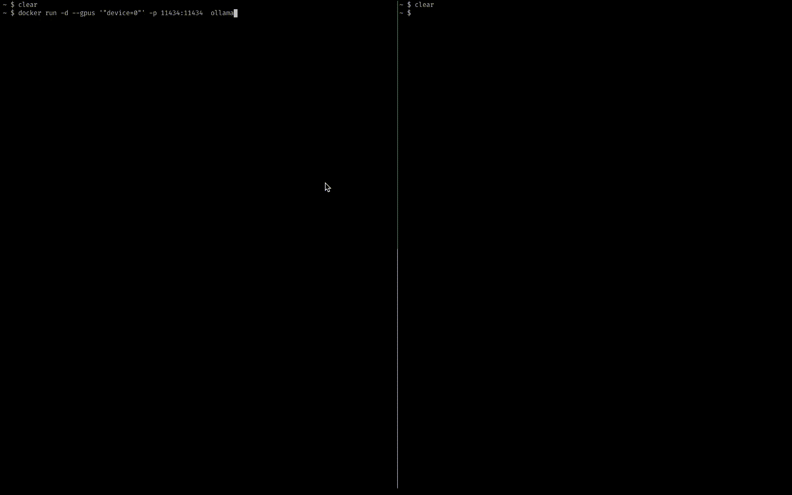

# 🚀 Deployment

Ensure you have the Hugging Face pre-trained LLM directory with tokenizer, model, and config files before deployment. Download LLMs using this Python code:

<details close>
  <summary><b><font size="5">Download</font></b></summary>
  <br>

```python
from transformers import AutoTokenizer, AutoModelForCausalLM

# Model ID
model_id = "airesearch/LLaMa3-8b-WangchanX-sft-Demo"

# Load tokenizer and model
tokenizer = AutoTokenizer.from_pretrained(model_id, use_fast=False)
model = AutoModelForCausalLM.from_pretrained(model_id, device_map="auto")

# Save tokenizer and model
path = "LLaMa3-8b-WangchanX-sft-Demo"
tokenizer.save_pretrained(path)
model.save_pretrained(path)
```

</details>

<br>
<details open>
  <summary><b><font size="5">Text Generation Inference</font></b></summary>
  <br></br>
  
  <br>
  <br>
  Text Generation Inference (TGI) is a toolkit that simplifies the deployment and serving of Large Language Models (LLMs). It offers advanced features such as tensor parallelism, quantization, watermarking, and custom prompt generation, making it easy to deploy and utilize LLMs in various applications. You can find more <a href="https://github.com/huggingface/text-generation-inference?tab=readme-ov-file#get-started">details</a>.
<h4></h4>

- At the current working directory location, prepare the following:

  - The directory containing the pre-trained LLM model from Hugging Face. For example, if you are using the `LLaMa3-8b-WangchanX-sft-Demo` model, the directory should be named `LLaMa3-8b-WangchanX-sft-Demo`.

<br>

- Create a <code>Dockerfile</code> with the following content to build a Docker image:

```Dockerfile
FROM ghcr.io/huggingface/text-generation-inference:2.0
COPY LLaMa3-8b-WangchanX-sft-Demo /data/LLaMa3-8b-WangchanX-sft-Demo
```

- Build the image using the following command:

```bash
docker build -t text-generation-inference -f <Dockerfile> .
```

- Alternatively, you can simply build the image which we already provided in the deployment directory:

```bash
docker build -t text-generation-inference -f deployment/TGI/Dockerfile.TextGenerationInference .
```

- Run the image using this command:

```bash
docker run --gpus all -p 8888:80 text-generation-inference --model-id /data/LLaMa3-8b-WangchanX-sft-Demo #you can add -d flag to run in background
```

- And then you can make requests like this:

```bash
curl 127.0.0.1:8888/generate_stream \
    -X POST \
    -d '{"inputs":"<|user|>ลิเก กับ งิ้ว ต่างกันอย่างไร<|end_of_text|>\n<|assistant|>\n","parameters":{"max_new_tokens":2048}}' \
    -H 'Content-Type: application/json'
```

- Preview:


---

**NOTE**

Don't forget to add chat template `<|user|>` message .... `<|end_of_text|>\n<|assistant|>\n` in inputs requests for more nice results.

---

</details>
  <br>
<details open>
  <summary><b><font size="5">LocalAI</font></b></summary>
<br></br>

<br>
<br>
LocalAI is a free, open-source OpenAI alternative. It provides a drop-in REST API compatible with OpenAI's specs for local/on-prem inference with LLMs, image/audio generation across model families on consumer hardware sans GPU. You can find more <a href="https://localai.io">details</a>.
<h4></h4>

- At the current working directory location, prepare the following:

  - The directory containing the pre-trained LLM model from Hugging Face. For example, if you are using the `LLaMa3-8b-WangchanX-sft-Demo` model, the directory should be named `LLaMa3-8b-WangchanX-sft-Demo`.

  - The model YAML file. This file can be found in the `deployment/LocalAI` directory. For the `LLaMa3-8b-WangchanX-sft-Demo` model, the YAML file would be named `LLaMa3-8b-WangchanX-sft-Demo.yaml`.
    <br>

- Create a <code>Dockerfile</code> with the following content to build a Docker image:

```Dockerfile
FROM localai/localai:latest-aio-gpu-nvidia-cuda-12
COPY LLaMa3-8b-WangchanX-sft-Demo  /build/models/LLaMa3-8b-WangchanX-sft-Demo
COPY LLaMa3-8b-WangchanX-sft-Demo.yaml /build/models
```

- Build the image using the following command:

```bash
docker build -t localai -f <Dockerfile> .
```

- Alternatively, you can simply build the image which we already provided in the deployment directory:

```bash
docker build -t localai -f deployment/LocalAi/Dockerfile.LocalAi .
```

- Run the image using this command:

```bash
docker run --gpus all -p 8888:8080 localai #you can add -d flag to run in background
```

- And then you can make requests like this:

```bash
curl http://localhost:8888/v1/chat/completions \
    -H "Content-Type: application/json" \
    -d '{ "model": "LLaMa3-8b-WangchanX-sft-Demo", "messages": [{"role": "user", "content": "ลิเก กับ งิ้ว ต่างกันอย่างไร", "temperature": 0.1}] }'
```

- Preview:


</details>
  <br>
<details open>
  <summary><b><font size="5">Ollama</font></b></summary>
<br></br>

<br>
<br>
Ollama is an open-source and user-friendly platform that allows you to run large language models (LLMs) locally on your machine. You can find more <a href="https://github.com/ollama/ollama">details</a>.
<h4></h4>

- At the current working directory location, prepare the following:

  - The directory containing the pre-trained LLM model from Hugging Face. For example, if you are using the `LLaMa3-8b-WangchanX-sft-Demo` model, the directory should be named `LLaMa3-8b-WangchanX-sft-Demo`.

    <br>

- Create a <code>Dockerfile</code> with the following content to build a Docker image:

```Dockerfile
FROM ollama/ollama

COPY LLaMa3-8b-WangchanX-sft-Demo /root/LLaMa3-8b-WangchanX-sft-Demo

RUN apt update && apt-get install python3 python3-pip python3-venv git -y

# Clone the ollama repository first
RUN git clone https://github.com/ollama/ollama.git /root/ollama

# Change to the cloned ollama directory
WORKDIR /root/ollama

# Initialize and update git submodules
RUN git submodule update --init --recursive

# Create and activate virtual environment
RUN python3 -m venv .venv
RUN . .venv/bin/activate
RUN python3 -m pip install -r llm/llama.cpp/requirements.txt

# Build the submodule
RUN make -C llm/llama.cpp quantize

# Convert
RUN python3 llm/llama.cpp/convert-hf-to-gguf.py /root/LLaMa3-8b-WangchanX-sft-Demo --outtype f16 --outfile /root/LLaMa3-8b-WangchanX-sft-Demo.gguf
```

- Build the image using the following command:

```bash
docker build -t ollama -f <Dockerfile> .
```

- Alternatively, you can simply build the image which we already provided in the deployment directory:

```bash
docker build -t ollama -f deployment/Ollama/Dockerfile.Ollama .
```

- Run the image using this command:

```bash
docker run -d --gpus all -p 11434:11434  ollama #you can add -d flag to run in background
```

- Create model:

```bash
curl http://localhost:11434/api/create -d '{
  "name": "LLaMa3-8b-WangchanX-sft-Demo",
  "modelfile":"FROM /root/LLaMa3-8b-WangchanX-sft-Demo.gguf\n\n\nTEMPLATE \"\"\"\n{{ if .System }}<|system|>\n{{.System}}<|end_of_text|>\n{{ end }}{{ if .Prompt }}<|user|>\n{{ .Prompt }}<|end_of_text|>\n{{ end }}<|assistant|>\n\"\"\"\n\nPARAMETER stop \"<|end_of_text|>\"\nPARAMETER stop \"<|assistant|>\"\nPARAMETER stop \"<|user|>\"\nPARAMETER stop \"<|system|>\""
}'
```

- And then you can make requests like this:

```bash
curl http://localhost:11434/api/chat -d '{
  "model": "LLaMa3-8b-WangchanX-sft-Demo",
  "messages": [
    {
      "role": "user",
      "content": "ลิเก กับ งิ้ว ต่างกันอย่างไร"
    }
  ]
}'
```

- Preview:



</details>
